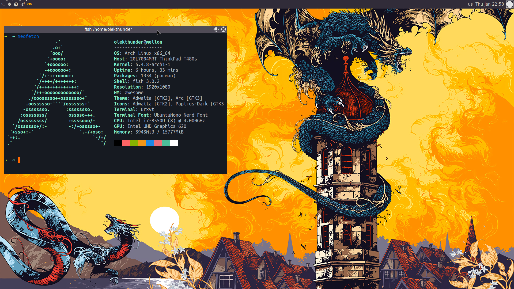

# Awesome WM config

Configuration files for [Awesome window manager](https://awesomewm.org/doc/)

## Version info

```
awesome v4.3 (Too long)
 • Compiled against Lua 5.3.5 (running with Lua 5.3)
 • D-Bus support: ✔
 • execinfo support: ✔
 • xcb-randr version: 1.6
 • LGI version: 0.9.2
```

## Screenshot


